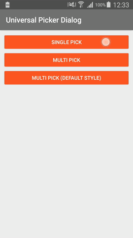

# UniversalPickerDialog
Customizable dialog with auto generated pickers inside that depend on the dataset count.



### Who we are
Need iOS and Android apps, MVP development or prototyping? Contact us via info@stfalcon.com. We develop software since 2009, and we're known experts in this field. Check out our [portfolio](https://stfalcon.com/en/portfolio) and see more libraries from [stfalcon-studio](https://stfalcon-studio.github.io/).

### Download

Download via Gradle:
```gradle
compile 'com.github.stfalcon:universalpickerdialog:0.1.0'
```

or Maven:
```xml
<dependency>
  <groupId>com.github.stfalcon</groupId>
  <artifactId>universalpickerdialog</artifactId>
  <version>0.1.0</version>
  <type>pom</type>
</dependency>
```

### Usage

Implement callback interface:
```java
public class MainActivity extends AppCompatActivity
        implements View.OnClickListener, UniversalPickerDialog.OnPickListener {
```

Then implement OnPickListener.onPick(int[], int) method:
```java
@Override
public void onPick(int[] selectedValues, int key) {
    String str = list.get(selectedValues[0]);
    Object obj = array[selectedValues[0]];

    /*do some logic*/
}
```

Now you can build the dialog and show it. Just add these few lines:
```java
new UniversalPickerDialog.Builder(this)
                .setTitle(R.string.hello)
                .setListener(this)
                .setInputs(
                        new UniversalPickerDialog.Input(0, list),
                        new UniversalPickerDialog.Input(2, array)
                )
                .show();
```
Data set is passing to Picker using Input class that supports lists as well as arrays, so no data conversion is required :)).
It takes in constructor default item position in carousel as the first argument and data set as the second.

Builder was extended by a many methods for more flexibility and convenience of use.
Here's the full list (you can find the javadoc on each of these methods):
```java
new UniversalPickerDialog.Builder(this)
                .setTitle(R.string.hello)
                .setTitle("Hello!")
                .setTitleColorRes(R.color.green)
                .setTitleColor(Color.GREEN)
                .setBackgroundColorRes(R.color.white)
                .setBackgroundColor(Color.WHITE)
                .setContentTextColorRes(R.color.green)
                .setContentTextColor(Color.GREEN)
                .setPositiveButtonText(R.string.yep)
                .setPositiveButtonText("Yep!")
                .setNegativeButtonText(R.string.nope)
                .setNegativeButtonText("Nope!")
                .setButtonsColor(R.color.green)
                .setButtonsColorRes(Color.GREEN)
                .setPositiveButtonColorRes(R.color.green)
                .setPositiveButtonColor(Color.GREEN)
                .setNegativeButtonColorRes(R.color.red)
                .setNegativeButtonColor(Color.RED)
                .setContentTextSize(16)
                .setListener(this)
                .setInputs(
                        new UniversalPickerDialog.Input(2, list),
                        new UniversalPickerDialog.Input(0, array)
                )
                .setKey(123)
                .build()
                .show();
```

Take a look at the [sample project](https://github.com/stfalcon-studio/UniversalPickerDialog/tree/master/sample) for more information.

### License

```
Copyright (C) 2017 stfalcon.com

Licensed under the Apache License, Version 2.0 (the "License");
you may not use this file except in compliance with the License.
You may obtain a copy of the License at

http://www.apache.org/licenses/LICENSE-2.0

Unless required by applicable law or agreed to in writing, software
distributed under the License is distributed on an "AS IS" BASIS,
WITHOUT WARRANTIES OR CONDITIONS OF ANY KIND, either express or implied.
See the License for the specific language governing permissions and
limitations under the License.

```
